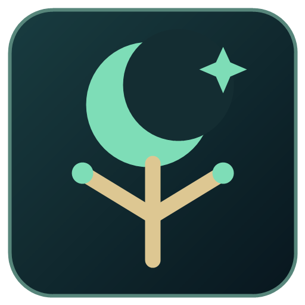
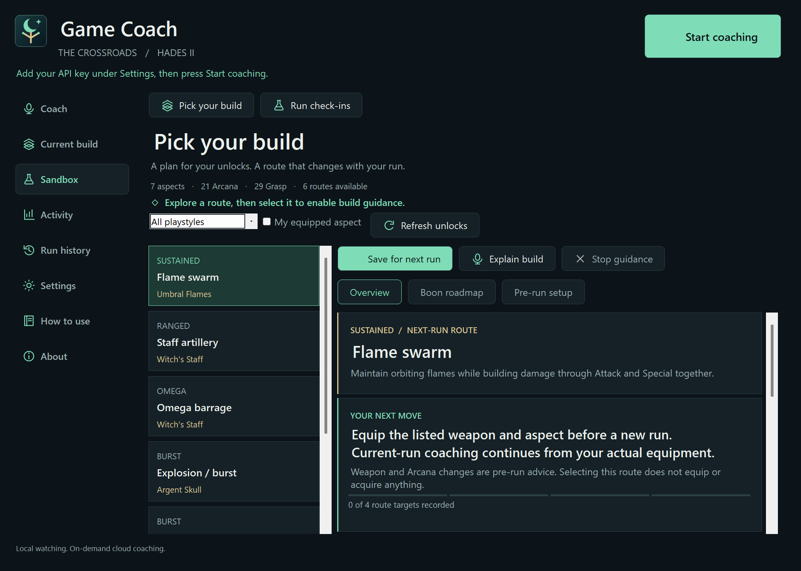
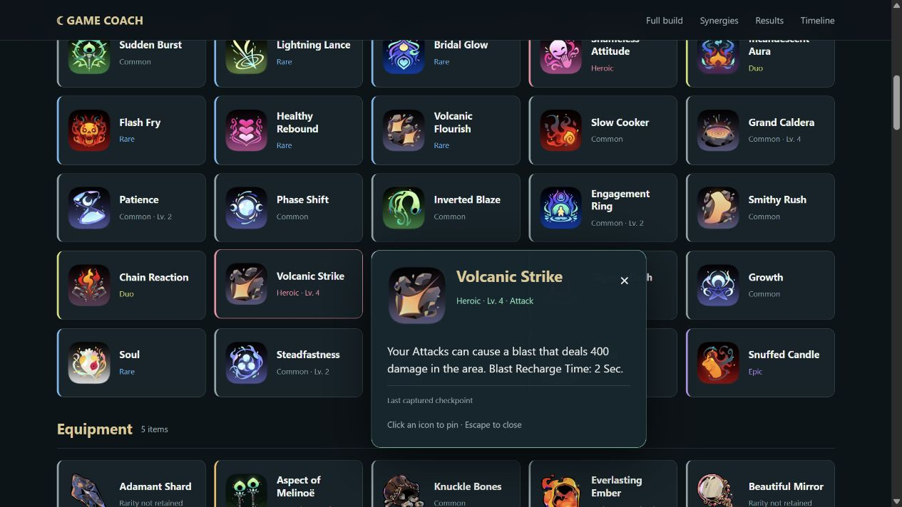

# Hades II Game Coach · The Crossroads

A Windows companion that combines local screen reading and save checkpoints with an on-demand voice coach. Choose a build, compare offered boons, get boss introduction tips, and turn completed or failed attempts into shareable run stories.

Created by **Caganmiller** · [Inquiries](mailto:caganmiller@gmail.com)

**Preview release.** This is a portable app, with source included in this repository. Local model weights, the inference engine, your API key, and game artwork are separate. The clean download contains no player settings, credentials, run history, screenshots, recordings, or developer logs.

## A look inside

| Plan your next run | Share the story afterward |
| --- | --- |
|  |  |

**[Explore the full screenshot gallery →](docs/SCREENSHOTS.md)** — the coach, build planner, run history, interactive HTML report, and boon/boss cards. App views use an isolated demonstration profile; overlay cards are captures of the real renderer, with their source explained in the gallery. The approved example images are documentation only and are not included in the portable app ZIP.

## Install in six steps

1. **Download the app** from [Releases](https://github.com/caganmiller/hades2-game-coach/releases/latest): choose `hades2-game-coach-v0.1.0-windows.zip`. GitHub's automatic “Source code” downloads are for building the app yourself. Extract the entire app ZIP to a writable folder such as `Documents\Hades2GameCoach`; do not run it from inside the ZIP or put it in Program Files.
2. **Check Windows requirements.** Use Windows 11, .NET Framework 4.8 or newer, English speech recognition and OCR language components, and a working default microphone. Run Hades II in English. The desktop executable is x64; Windows ARM64 runs it through x64 emulation. The local inference engine must match your actual CPU/GPU. See the [installation guide](docs/INSTALL.md).
3. **Install the local engine and vision model.** Download a compatible [llama.cpp Windows release](https://github.com/ggml-org/llama.cpp/releases), the `Qwen3.6-35B-A3B-UD-Q4_K_M.gguf` model, and its matching `mmproj-BF16.gguf` from the [model repository](https://huggingface.co/unsloth/Qwen3.6-35B-A3B-MTP-GGUF). Keep the engine's companion DLLs together. The model and projector alone occupy about 24 GB; inference and the game need additional memory. This is a substantial local model, not a small background utility.
4. **Open `GameCoach.exe`.** In **Settings → Local watcher → Model startup**, select `llama-server.exe`, the model, and the matching projector. Set model ID to `Qwen3.6-35B-A3B-UD-Q4_K_M`. Keep automatic startup enabled and use **Save & load model**. Wait for **Ready**, then run **Save & test locally** in Connection details. Hermes is optional; once configured, the app starts its own engine.
5. **Connect voice coaching.** Create your own [OpenAI Platform project API key](https://platform.openai.com/api-keys), enable API billing, then enter it in **Settings → Cloud coach → API key → Save API key**. Your ChatGPT subscription is separate. The current defaults use `gpt-6-luna` for coaching, `gpt-transcribe` for questions, and `gpt-realtime-2.1-mini` for speech. Your project must have access to these models and endpoints. Keep the key out of GitHub and shared files.
6. **Play.** Press **Start coaching**, switch to Hades II, say **“coach”**, wait for the tone, then ask. **“Thanks”** silences a reply. **Pause coaching** stops listening and watching while preserving the run. For local guidance without a cloud key, use the separate overlay controls in Settings.

**Full instructions:** [Install and troubleshoot](docs/INSTALL.md) · [Controls and first-run checklist](docs/USAGE.md) · [Privacy and local data](docs/PRIVACY.md) · [Build from source](docs/DEVELOPMENT.md)

## What it does

| Area | Features |
| --- | --- |
| Voice | Local wake detection, short cloud transcription, streamed answers, interruption, volume and speed controls |
| Automatic guidance | Boon comparisons, keepsake suggestions, boss dialogue tips, and confident door/build target markers |
| Memory | Read-only save checkpoints for equipped weapon/aspect, Arcana, choices, rarity, levels, and unlocks; uncertain visual picks remain unconfirmed |
| Build planning | Curated community-informed routes filtered against recorded unlocks, with targets and adaptations |
| Run history | Completed and failed attempts, synergy groups, retained stats, loadout filters, and available victory context |
| Sharing | Standalone interactive HTML, two-page PDF summary, PNG card, text, CSV, and a four-format ZIP |
| Hybrid activity | Local/cloud request and latency charts, outcomes, and provider-reported token usage |

The app observes and advises. It does not press game controls or modify saves. It reads supported local saves even while coaching is paused so history and checkpoints can stay current. An unsaved choice may take time to appear. Boss guidance is an introduction card; it is not continuous real-time combat commentary.

## What stays local, and what uses API credit?

Local wake recognition, OCR, save parsing, and automatic watcher inference run on your PC. Automatic watching has **no cloud fallback**. Idle wake listening makes no cloud requests. The local engine still uses memory and compute; Pause does not unload it, while closing the app stops an engine the app owns.

Asking the cloud coach sends the question, relevant run context, and a capture of your selected game display. Voice questions also send a short audio recording for transcription; spoken replies use cloud audio. Optional start/victory greetings can use cloud speech while coaching is active. Web research is available for complex or uncertain questions. See [the data-flow details](docs/PRIVACY.md).

## Optional extras

- **Original item icons:** run the included importer against your own Hades II installation. No extracted icon pack is bundled; gallery images show the optional artwork in use. Text, levels, descriptions, and reports work without imported icons. [Import instructions](docs/INSTALL.md#optional-import-item-icons).
- **PDF and full share ZIP:** install Python 3 and ReportLab, then set `pdf-python.txt` beside the app. HTML, PNG, text, and CSV do not need Python. [PDF setup](docs/INSTALL.md#optional-pdf-export).

## Current limits

This release was built and checked on a Windows ARM64 development machine with a compatible NVIDIA/CUDA llama.cpp engine. Other GPUs, engine builds, monitor layouts, game updates, and model combinations need their own validation. We do not claim a minimum supported VRAM figure or equal performance on ordinary gaming PCs. English layouts and the current save format are the supported target.

Visual guidance can be late or uncertain. Check the actual offer and current build. Older run history may omit exact levels, times, or effects; the app labels missing data instead of inventing it. Community routes are starting points, not guaranteed speedrun rankings. The executable is unsigned, so Windows may show publisher/reputation warnings; it is not a Microsoft Store package.

Independent fan companion; not affiliated with or endorsed by Supergiant Games, OpenAI, Nous Research, NVIDIA, or model/runtime publishers. See [third-party notices](THIRD_PARTY_NOTICES.md). No open-source license is granted in this preview; public access to this repository does not change third-party rights.
