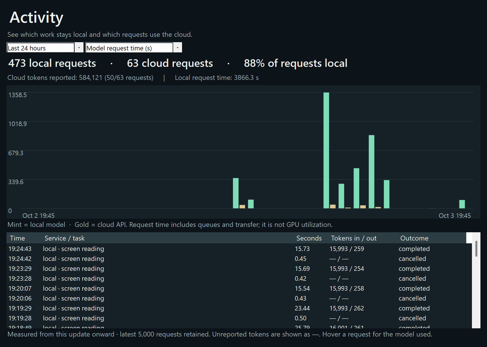
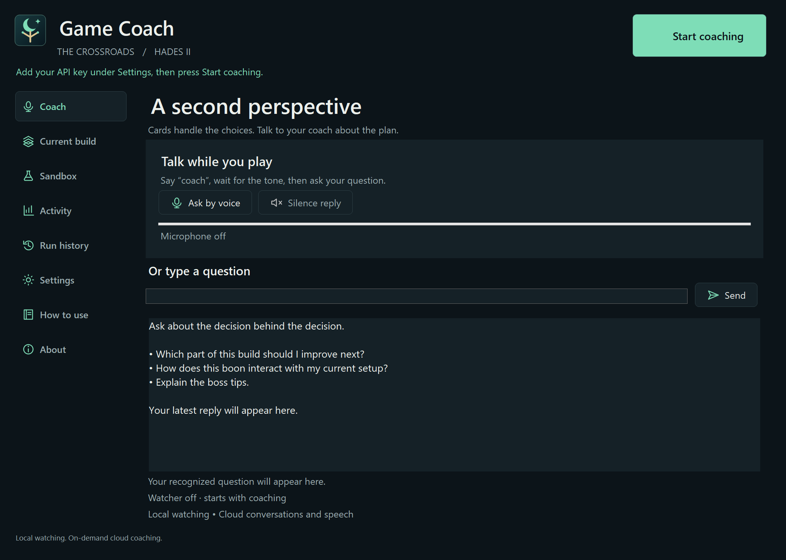
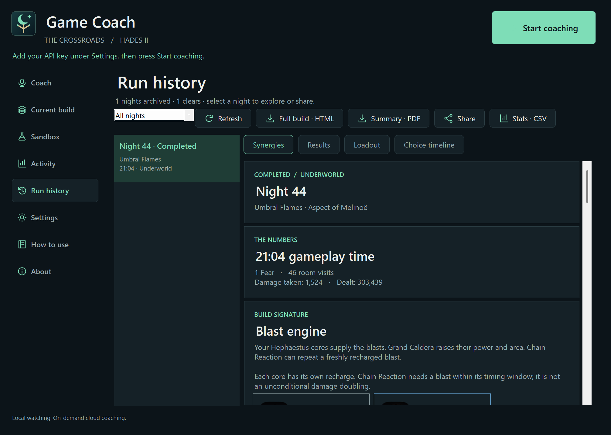
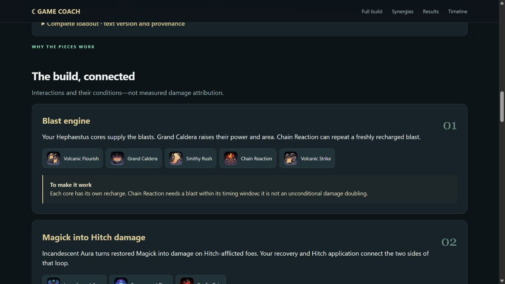
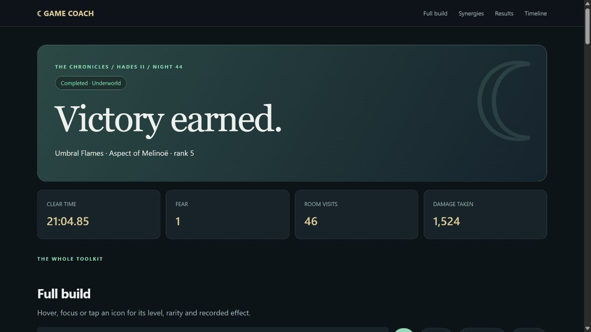
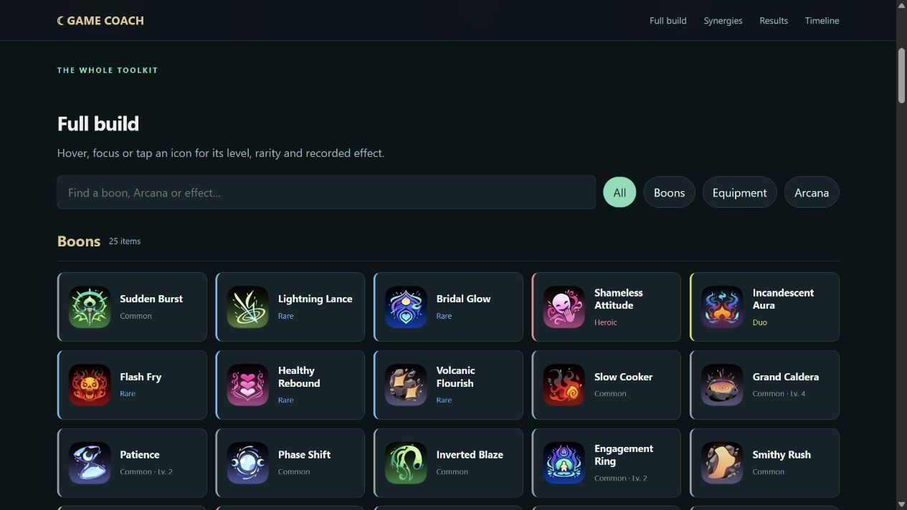
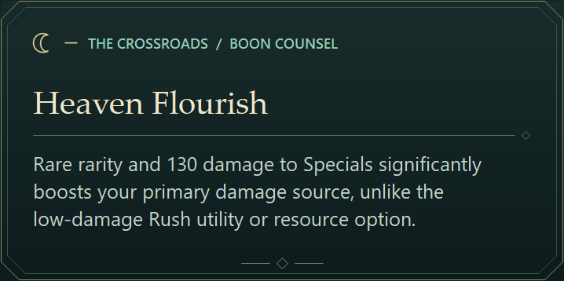
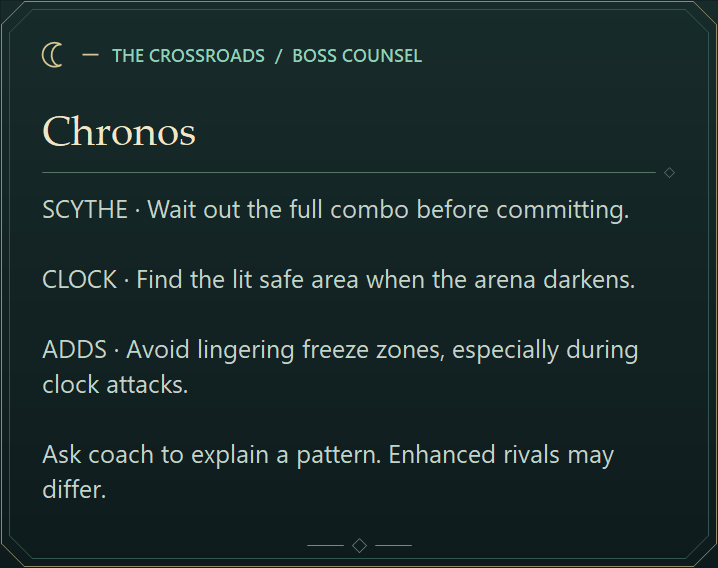

# Inside The Crossroads

[Back to the app](../README.md) · [Install](INSTALL.md) · [How to use](USAGE.md)

Follow a run from the first build idea to the final recap. Local AI watches your choices, the voice coach helps you think through the plan, and shared memory keeps both connected to your build.

## Hybrid AI Gaming Coach

**88% local · 12% cloud in an example 24-hour period.** Most of the recorded model requests stayed on the PC. That's what makes the hybrid approach useful: automatic observation can keep running locally, while the cloud brings voice, conversation, and deeper advice when you call on it.

The Activity view shows where that work happens—mint for local AI, gold for the cloud. In this development example, it recorded **473 local requests and 63 cloud requests**. Both sides use the same run context, so the voice coach can discuss the build the watcher is following. Your balance will vary with how you play and how often you ask for advice.

### About the activity example

The percentages describe the split of recorded requests within one 24-hour window, including tests and cancellations. Keeping automatic watching local removes the need for cloud API calls for that work; your cloud bill depends on the models and services you use.

How the activity view is measured

The chart adds up request duration in seconds, including inference, queueing, and transfer. Token totals use the usage supplied by each provider: this example contains **584,121 reported cloud tokens across 50 of the 63 cloud requests**. Use your OpenAI project dashboard to review charges.

The sample contains 536 recorded requests: 363 completed, 172 cancelled, and one failed/incomplete. Recording began partway through the selected window. It also includes development tests and an earlier cloud boss-check experiment; the current boss experience uses local introduction cards with cloud explanations on request.

The image was captured from the app's Activity panel using a separate copy of those records. Raw usage history stays private. See [privacy and data flow](PRIVACY.md).

## Voice coach

Start coaching, return to the game, and say “coach” when you want a second opinion. Ask what to prioritize, how a boon fits, or why a boss tip matters. Say “thanks” to silence a reply, or type a question when that's easier.

## Pick your build

Find a route you can build with the equipment you've unlocked. Browse its playstyle, see the boons to look for, and prepare your weapon and Arcana before the run. Choose a plan to guide later decisions while you keep control of every pick.

## Run history

Every attempt leaves something to learn from. Browse completed and failed runs, revisit the build, and see how its pieces worked together. Export the full story as HTML or keep a shorter PDF recap. This example shows Night 44.

## Full build report

Share more than a list of items. The full build report connects your boons, equipment, and Arcana to explain how the run came together. Friends can open the HTML file in a browser without an account.

### Synergies

See the combinations that define the build, from a Hephaestus blast engine to Magick recovery feeding Hitch damage. Each group explains the interaction and what you need to do to make it work.

### Results and full loadout

This Night 44 clear used Umbral Flames, Aspect of Melinoë, and finished in 21:04.85.

The full build groups boons, equipment, and Arcana in that order. Search and filters narrow the list.

### Boon details

In the HTML report, hover or select a boon to explore its saved rarity, level, and effect. Here, Volcanic Strike is pinned open so you can read the details alongside the rest of the build.

## Boon counsel

A short recommendation and a reason, right when you're weighing a choice. On this Zeus menu, the watcher compared Heaven Flourish, Thunder Rush, and Ionic Gain. The card below uses its recorded recommendation, captured separately through the app's overlay renderer.

## Boss briefing

Use the opening dialogue to get a few useful reminders before the fight. If a pattern needs more explanation, call on the voice coach. This is a **staged preview of the app's Chronos briefing card**, captured with the same renderer used in play.

## About these captures

The app views use the existing Windows controls in a separate profile prepared for the gallery. The Activity chart uses real request records, and the report images are direct browser captures of the player-approved Night 44 export. Overlay cards are captured separately because the app keeps its own advice out of the watcher's screen reads.

All images were reviewed before sharing. API keys, conversations, raw usage history, saves, and recordings stay private. These examples are part of the documentation; the portable app download starts fresh.

Hades II item artwork and game content © Supergiant Games. This is an independent fan companion; see [third-party notices](../THIRD_PARTY_NOTICES.md).
